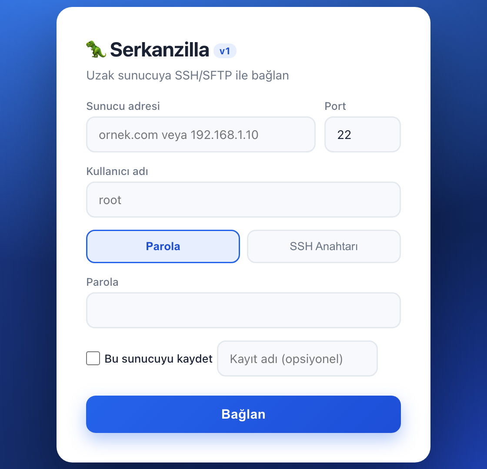
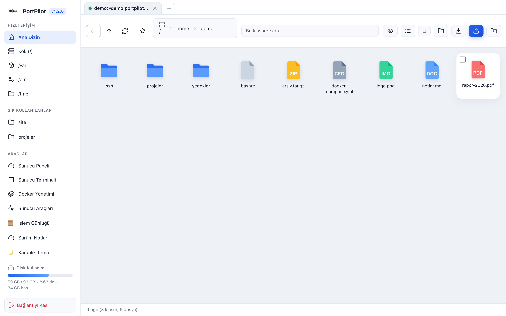
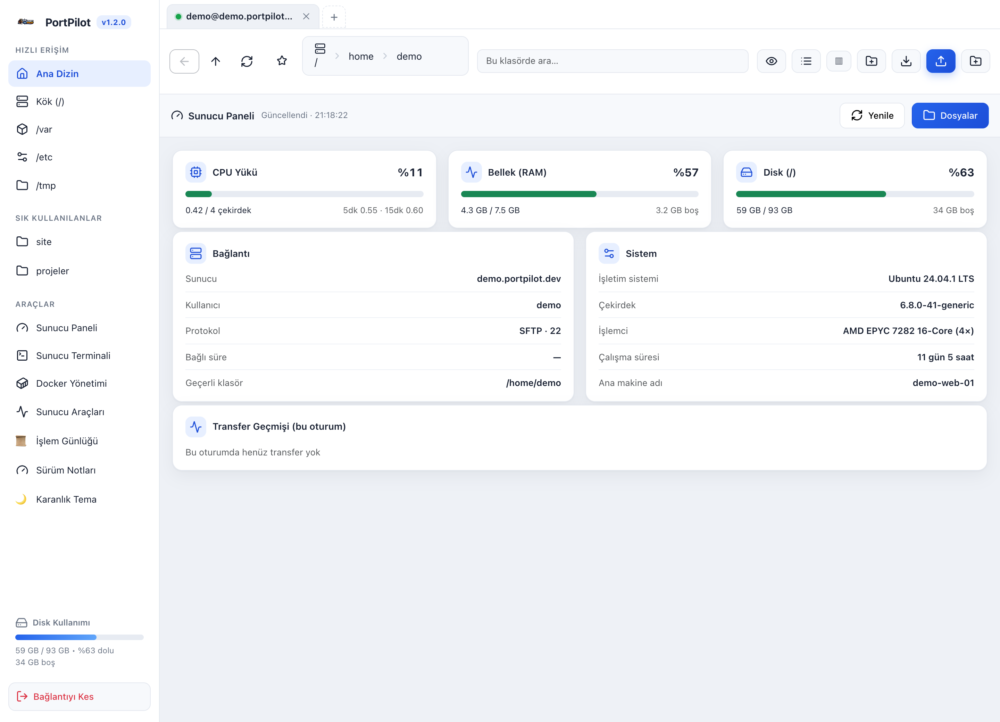
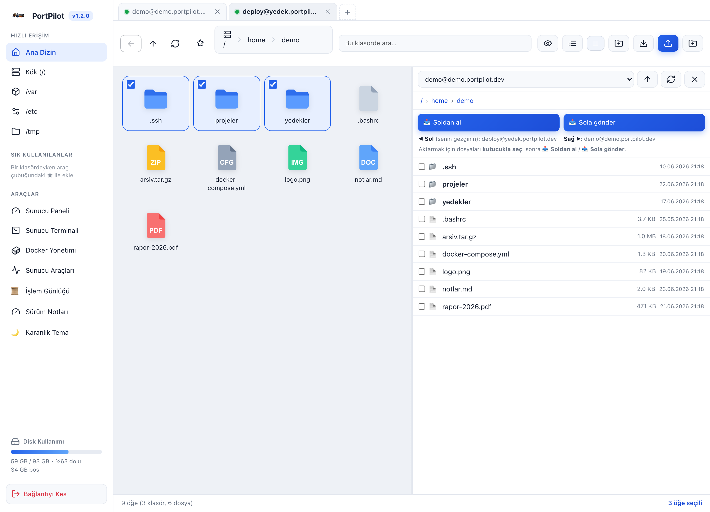
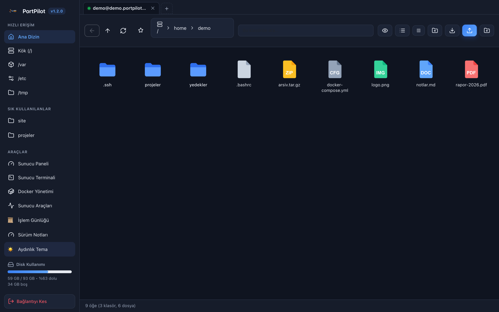
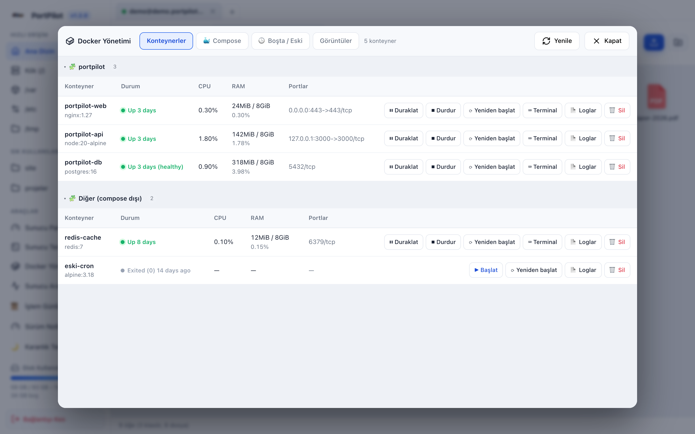
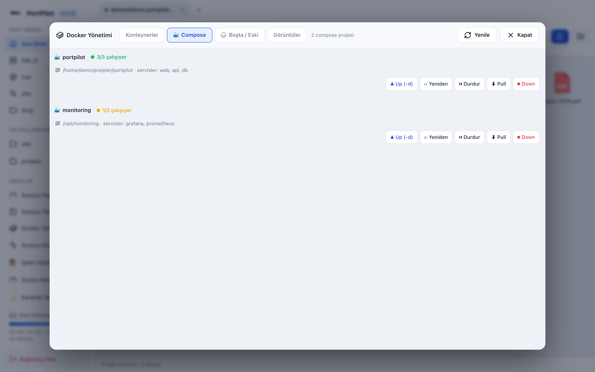
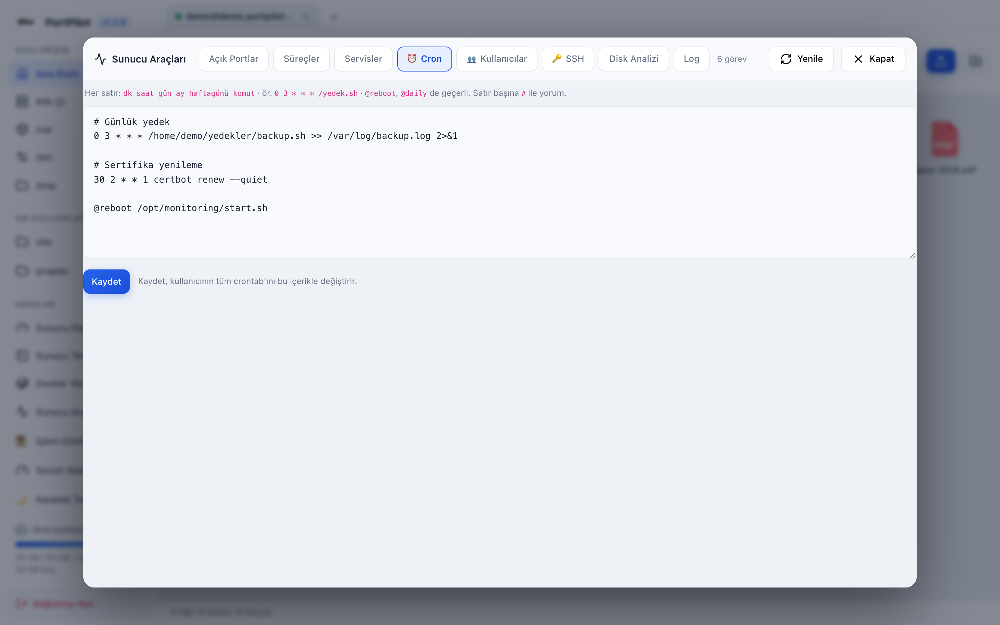
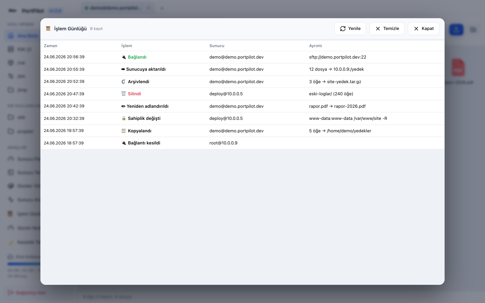

# 🦖 PortPilot

  

Uzak sunuculara **SFTP, FTP veya FTPS** ile bağlanıp tarayıcıdan ya da masaüstü uygulamasından,
tıpkı Windows Dosya Gezgini gibi dosya yönetimi yapmanı sağlayan, çapraz platform
(macOS · Windows · Linux) bir araç. Üstüne **Docker yönetimi**, **sunucu araçları**
(cron · kullanıcılar · servisler · portlar · SSH anahtarı), **çift panel (FileZilla tarzı)**,
**işlem günlüğü** ve **karanlık tema** ekler.

> Bağlantı ekranından protokolü seç (SFTP / FTP / FTPS) ve istediğin portu gir.
> Docker, sunucu araçları, disk analizi ve `.tar.gz` indirme gibi komut tabanlı özellikler yalnızca SFTP (SSH) bağlantılarında çalışır.
> Hiçbir kimlik bilgisi internete gönderilmez; her şey kendi makinende çalışır.

---

## 📸 Ekran Görüntüleri

> Aşağıdaki görüntüler **demo (örnek) verilerle** alınmıştır — gerçek sunucu/kimlik bilgisi içermez.

### Bağlantı ekranı
Protokol seçimi, parola veya SSH anahtarı, gruplara ayrılmış kayıtlı sunucularla tek tıkla bağlanma; FileZilla'dan içe aktarma.



### Dosya Gezgini
Masaüstü tarzı simge görünümü, türüne göre dosya ikonları, kenar çubuğunda sık kullanılanlar, hızlı erişim ve disk kullanımı.



### Sunucu Paneli (Dashboard)
Bağlantı sonrası CPU / RAM / disk, sistem bilgileri ve yük özeti.



### Çift Panel (split-pane)
İki sunucuyu yan yana aç; seçili dosyaları **Sol ➡ Sağ / Sol ⬅ Sağ** ile doğrudan aktar (FileZilla tarzı).



### Karanlık Tema
Tek tıkla karanlık/aydınlık tema; seçim hatırlanır.



### Docker Yönetimi & Compose
Konteynerleri başlat/durdur/sil, canlı CPU·RAM, loglar; **Compose** sekmesinde stack bazlı up/down/restart/pull.





### Sunucu Araçları (cron / kullanıcılar / SSH …)
Açık portlar, süreçler, servisler, **cron**, **kullanıcı & grup**, **SSH anahtarı**, disk analizi ve log.



### İşlem Günlüğü (audit)
Bağlantılar ve dosya işlemleri zaman damgalı kayıt.



---

## ✨ Özellikler

### 📁 Dosya yönetimi
- **İki görünüm:** Masaüstü tarzı **simge (ızgara)** ve detaylı **liste** — tercih hatırlanır
- **Sütun bazlı sıralama:** Ad / Değiştirilme / Tür / Boyut başlığına tıkla; klasörler hep üstte
- Klasör gezme, adres çubuğu (breadcrumb), geri / üst / yenile, **özyinelemeli arama**
- **Sürükle-bırak** ile **dosya ve klasör** yükleme — klasörler alt klasörleriyle (yapı korunur)
- **Transfer kuyruğu:** çok sayıda yükleme sıraya alınır (duraklat/devam), **paralel + akış (stream)** — RAM şişmez
- **Aktarım seçenekleri (FileZilla tarzı):** çakışma davranışı — **Üzerine yaz · Atla · İkisini tut** + paralel sayısı
- **İndirme:** tek dosya, klasör (`.tar.gz`), **çoklu seçip tek arşiv**, ya da **sürükleyip masaüstüne bırak**
- **Sürükleyip indirme · arşivle/çıkar (tar.gz/zip) · toplu yeniden adlandırma (regex/sıralı, canlı önizleme)**
- **Kopyala / Kes / Yapıştır**, yeni klasör, yeniden adlandırma / taşıma, özyinelemeli silme (ilerleme çubuğu)
- **İzinler (chmod)** ve **Özellikler** paneli (sahip/grup, sekizlik+simgesel izin, özyinelemeli boyut)
- **Önizleme:** resim ve PDF'i indirmeden pencerede gör · **yerleşik metin düzenleyici** (`Ctrl/Cmd+S`)
- **Dış uygulamada düzenle (masaüstü):** dosyayı varsayılan uygulamada (VS Code/Sublime/Preview…) aç → **her kaydedişte otomatik sunucuya geri yüklenir** (FileZilla tarzı)
- **Sunucudan sunucuya aktarım** ve **çift panel (split-pane):** iki sunucuyu — ya da **bu bilgisayarı (yerel ↔ sunucu, masaüstünde)** — yan yana açıp aralarında aktar
- Sol kenar çubuğunda **sık kullanılanlar**, hızlı erişim ve **disk kullanım** göstergesi

### 🐳 Docker yönetimi
- Konteynerleri listele; **başlat · durdur · duraklat · yeniden başlat · sil**, **canlı CPU/RAM**, **log görüntüleyici**
- **Docker Compose:** stack (proje) bazlı görünüm — **up / down / restart / stop / pull**
- **Boşta / eski konteyner** analizi ve **prune** (durmuş konteyner / dangling imaj temizliği)
- **Görüntü (image)** listesi ve silme

### 🧰 Sunucu araçları (yalnızca SFTP/SSH)
- **Açık portlar** (dinleyen TCP/UDP + süreç), **süreçler** (en çok CPU + sonlandır), **systemd servisleri** (başlat/durdur/yeniden)
- **Disk analizi** (`du` ile klasör bazında, oran çubuğu), **log kuyruğu** (tail)
- **Cron yönetimi** (crontab oku/düzenle/kaydet) + **sunucudaki tüm cron'ları tara** (`/etc/crontab`, `cron.d`, diğer kullanıcılar, periyodik betikler, **systemd timer**'ları — okunaklı zamanlama açıklamasıyla)
- **SSH tüneli** (yerel port yönlendirme): sunucu ağındaki bir servisi `localhost:port`'a güvenle taşı — DB/dahili panel için tek tıkla tünel, canlı trafik göstergesi
- **kullanıcı & grup** listesi + **chown**
- **SSH anahtarı üret & kur** (ed25519 → `authorized_keys`, parolasız bağlantı için özel anahtarı verir)

### 🔐 Bağlantı & güvenlik
- **SFTP / FTP / FTPS**; **parola** veya **SSH özel anahtarı** (anahtar yalnızca SFTP'de)
- **Kayıtlı sunucular:** kaydet, gruplara ayır, tek tıkla bağlan; **✎ ile düzenle** (silmeden host/port/kullanıcı güncelle)
- **Şifreli saklama:** parola/anahtar, işletim sistemi anahtarlığıyla (Electron `safeStorage`) şifrelenir — `servers.json` düz metin parola tutmaz
- **Uygulama kilidi:** master parola (scrypt + tuz), otomatik kilit, macOS'ta **Touch ID**
- **Oturum dayanıklılığı:** SFTP/SSH koparsa şeffaf **otomatik yeniden bağlanma**; kimlik bilgileri yalnızca bellekte **AES-256-GCM** ile şifreli (keep-alive + oto-reconnect)
- **İşlem günlüğü (audit):** bağlantılar ve dosya işlemleri (sil/taşı/kopyala/yeniden adlandır/arşiv/aktar) zaman damgalı kayıt
- Boşta kalan oturum otomatik kapanır

### 🎨 Deneyim
- **Komut yardımcısı (cheat-sheet):** Terminal ve Docker panelinde **"📋 Komutlar"** ile kategorize, aranabilir, iki dilli hazır komut listesi (~75 komut) — tıkla, komut satırına gelsin
- **Karanlık / aydınlık tema** (kalıcı, sistem tercihine uyar)
- **Dil seçeneği (Türkçe / English)** — kalıcı, ilk açılışta tarayıcı diline uyar
- **Sunucu paneli:** CPU / RAM / disk için canlı **sparkline geçmiş grafikleri** + **%90 eşik bildirimleri** (masaüstü)
- Çoklu sunucu **sekmeleri**, "Neler yeni?" sürüm notları, gerçek zamanlı sürüm rozeti

---

## 🚀 Kurulum

Gereksinim: **Node.js 18+**

```bash
git clone https://github.com/serkancakmakk/PortPilot.git
cd PortPilot
npm install
npm start
```

Tarayıcıdan **http://localhost:3000** adresini aç.

| Komut | Açıklama |
|-------|----------|
| `npm start` | Web sunucusunu başlatır (tarayıcı) |
| `npm run dev` | Otomatik yeniden başlatmalı geliştirme modu |
| `PORT=8080 npm start` | Farklı portta çalıştırır |
| `npm run app` | Masaüstü (Electron) penceresinde çalıştırır |

---

## 🖥️ Masaüstü uygulaması (Mac · Windows · Linux)

PortPilot, web aracının yanı sıra **çapraz platform bir masaüstü uygulaması** olarak da paketlenebilir
(Electron). Kurulum dosyalarını **kendi makinende sen derlersin** — depoda hazır ikili (binary) gönderilmez.

```bash
npm install          # electron + electron-builder dahil bağımlılıklar
npm run dist         # bulunduğun işletim sistemi için derler
```

Belirli platformlar için:

| Komut | Çıktı (`dist/` klasörüne) |
|-------|---------------------------|
| `npm run dist:mac` | `.dmg` (Intel + Apple Silicon) ve `.zip` |
| `npm run dist:win` | `Setup .exe` (kurulumlu) ve taşınabilir `.exe` |
| `npm run dist:linux` | `.AppImage`, `.deb`, `.rpm`, `.pacman` (x64 + arm64) |
| `npm run dist` | Geçerli işletim sistemi için hepsi |

> **Not:** Windows derlemesi macOS/Linux üzerinde electron-builder'ın gömülü wine'ı ile yapılabilir.
> macOS hedefleri yalnızca macOS'ta üretilebilir. Linux `.rpm` için `rpmbuild`, `.pacman` için
> `bsdtar` (libarchive-tools) + `zstd` gerekir; bunlar CI'da (Ubuntu) otomatik kurulur.

### Linux dağıtımı — hangi paketi kim kurar?

| Dağıtım | Dosya | Kurulum |
|---------|-------|---------|
| **CachyOS / Arch / Manjaro** | `.pacman` | `sudo pacman -U PortPilot-*-x86_64.pacman` |
| **Ubuntu / Debian** | `.deb` | `sudo apt install ./PortPilot_*_amd64.deb` |
| **Fedora / RHEL / openSUSE** | `.rpm` | `sudo dnf install ./PortPilot-*.x86_64.rpm` |
| **Her dağıtım (kurulumsuz)** | `.AppImage` | `chmod +x *.AppImage && ./*.AppImage` |

> AppImage FUSE2 ister; Arch tabanlılarda `sudo pacman -S fuse2` ya da
> `./*.AppImage --appimage-extract-and-run` ile çalıştırılır.

#### 🔁 CachyOS / Arch için otomatik güncellenen pacman deposu (önerilen)

AUR'a gerek yok. Her sürümde CI, x86_64 pacman paketini bir depoya çevirip `arch-repo`
release'inde yayımlar. Kullanıcı `/etc/pacman.conf` sonuna **bir kez** şunu ekler:

```ini
[portpilot]
SigLevel = Optional TrustAll
Server = https://github.com/serkancakmakk/PortPilot/releases/download/arch-repo
```

Sonra kurar ve bundan sonra normal sistem güncellemeleriyle otomatik güncel kalır:

```sh
sudo pacman -Sy portpilot     # kur
sudo pacman -Syu                # güncelle (yeni sürümler otomatik gelir)
```

### Web'den indirme (kullanıcılar için)
Web arayüzü (`npm start`) açıkken giriş ekranındaki **"💻 Masaüstü uygulamasını indir"** ile
kullanıcılar **kendi işletim sistemine uygun** kurulumu indirebilir (sistem otomatik algılanır).
Bu liste sunucudaki `dist/` klasörünü okur — yani **web sunucusunu barındıran makinede**
`npm run dist` çalıştırılmış (ya da `dist/` kopyalanmış) olmalıdır.

> `dist/` klasörü `.gitignore` ile dışlanmıştır; ikili dosyalar depoyu şişirir.
> Hazır kurulumları dağıtmak istersen **GitHub Releases**'e yükle (git geçmişine ekleme).

---

## 📖 Kullanım

1. **Bağlan:** Sunucu adresi, port (varsayılan 22) ve kullanıcı adını gir; parola veya SSH anahtarıyla doğrula.
2. **Gezin:** Klasöre çift tıkla; metin dosyaları düzenleyicide açılır, diğerleri indirilir.
3. **Yükle:** Dosya veya **klasörü** pencereye sürükle (ya da Yükle / Klasör Yükle butonları). Açılan **aktarım seçenekleri** penceresinden çakışma davranışını (üzerine yaz / atla / yeniden adlandır) ve paralel sayısını seç.
4. **İndir:** Bir öğe seç ve ⬇ İndir'e bas; ya da kutucuklarla çoklu seçip tek `.tar.gz` indir.
5. **Docker:** Sol menüden **🐳 Docker Yönetimi** ile konteynerleri yönet; **CPU/RAM** kullanımını canlı izle.
6. **Kaydet:** Giriş ekranında "Bu sunucuyu kaydet" ile bağlantıyı kalıcı hale getir.

### Klavye kısayolları
| Tuş | İşlev |
|-----|-------|
| `F2` | Yeniden adlandır (seçili öğe) |
| `F5` | Yenile |
| `Delete` | Sil (seçili öğe) |
| `Backspace` | Üst klasör |
| `Ctrl/Cmd + S` | Düzenleyicide kaydet |
| `Esc` | Düzenleyiciyi/paneli kapat |

---

## 🛠 Teknolojiler

- **Backend:** Node.js · [Express](https://expressjs.com/) · [ssh2](https://github.com/mscdex/ssh2) (SFTP + exec) · [basic-ftp](https://github.com/patrickjuchli/basic-ftp) · [multer](https://github.com/expressjs/multer) · [ws](https://github.com/websockets/ws) (terminal)
- **Masaüstü:** [Electron](https://www.electronjs.org/) + electron-builder (+ electron-updater otomatik güncelleme)
- **Frontend:** Saf, modüler HTML/CSS/JavaScript (framework yok) · [xterm.js](https://xtermjs.org/) terminal

## 📂 Proje yapısı

```
.
├── server.js          # Express uygulaması + sunucu başlatma
├── electron/          # Masaüstü (Electron) ana süreç + preload
├── routes/            # API uçları: connect, files, docker, sys, servers, prefs, lock, audit…
├── lib/               # remote-fs (SSH/SFTP), sessions, uploads, servers-store, audit…
├── public/
│   ├── index.html     # Arayüz iskeleti
│   ├── style.css      # Tasarım (Fluent/Win11 esinli) + karanlık tema
│   └── js/            # Modüler istemci (explorer, docker, systools, dual-pane, audit, theme…)
├── package.json
└── README.md
```

---

## 🔒 Güvenlik notları

- Kimlik bilgileri yalnızca aktif bağlantı için bellekte tutulur; SFTP işlemleri dışında ağa gönderilmez.
- **Kayıtlı sunucu parolaları/anahtarları şifreli saklanır:** işletim sisteminin anahtarlığından türetilen anahtarla (Electron `safeStorage`) şifrelenip `servers.json`'a yazılır — düz metin parola tutulmaz. (Anahtarlık olmayan ortamda düz metne düşer; o dosya yine de `.gitignore` ile dışlanmıştır, paylaşma.)
- **Uygulama kilidi** ile açılışta master parola istenebilir (cihazda scrypt + tuz ile hash'lenir).
- Araç yerel/güvenilir ağ için tasarlanmıştır. İnternete açacaksan önüne **HTTPS (ters proxy)** ve bir **kimlik doğrulama katmanı** koy.

---

## 📄 Lisans

MIT
